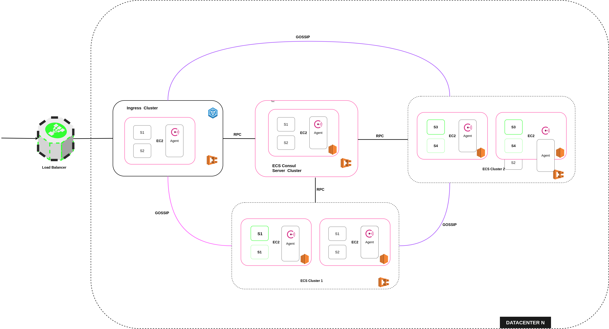

# Introduction

Consul is a distributed highly available and data center awaresolution to connect and Configure applications across dynamic, distributed infrsctructure.
Why Consul ?      
- Multi Datacenter
- Service Mesh/ Segmentations 
- Service Discovery
- Service health Checking
- Key/Value Storage for system wide dynamic configurations                                            
  
# Concepts
- Microservices
- Containerizations
- CI/CD Pipelines

# Tools Used
- Docker
- AWS
- Consul
- Spring Boot
- Github Actions

# Architecture

# Step By Step Implementation Guide

## Service Set up 
The project has 4 services implemented in springboot, these are dockerized to allow deployment on the proposed architecture. The service are language agnostic and can be implemented in framework of choice. The service included are

