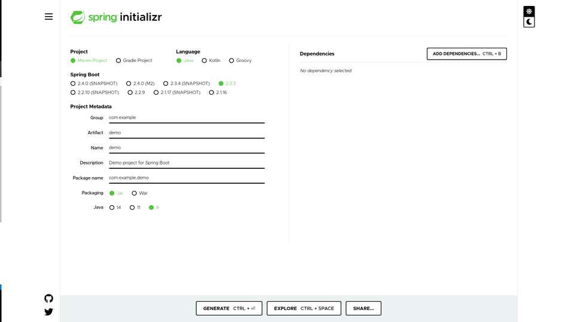

# Building and Dockerizing Spring Data Rest Application
## Introduction

In this article we will describe a simple approach to implementing a simple Rest API in spring boot and automate its deployment.

**prerequisites**
- Knowledge in Java 8+

## Getting Started
Ensure you have [JDK](https://docs.oracle.com/cd/E19182-01/820-7851/inst_cli_jdk_javahome_t/) and [Maven](https://www.tutorialspoint.com/maven/maven_environment_setup.htm) installed.
Head over to [Spring Initializr](https://start.spring.io/) and create your SpringBoot project with the following options.


Hit generate and extract the project to get started.

For this tutorial we'll create a simple User Resource API with the basic CRUD methods as well as OpenAPI documentation powered by Redoc.

## Define Your Folder Structure
```bash
├── Dockerfile
├── mvnw
├── mvnw.cmd
├── pom.xml
├── src
│   ├── main
│   │   ├── java
│   │   │   └── com
│   │   │       └── aws
│   │   │           └── users
│   │   │               ├── entities
│   │   │               ├── UsersApplication.java
│   │   │               └── repositories
│   │   └── resources
│   │       └── application.properties
│   └── test
│       └── java
│           └── com
│               └── aws
│                   └── users
│                       └── UsersApplicationTests.java
```

As defined in the structure above navigate to the base of your main package and create entities and repositories folders.
It is advisable to layer your application structure, an example is as shown below.

```bash
├── Dockerfile
├── mvnw
├── mvnw.cmd
├── pom.xml
├── src
│   ├── main
│   │   ├── java
│   │   │   └── com
│   │   │       └── aws
│   │   │           └── users
│   │   │               ├── entities/
│   │   │               ├── configs/
│   │   │               ├── controllers/
│   │   │               ├── helpers/
│   │   │               ├── ... (more)
│   │   │               ├── services/
│   │   │               ├── UsersApplication.java
│   │   │               └── repositories/
│   │   └── resources
│   │       └── application.properties
│   └── test
│       └── java
│           └── com
│               └── aws
│                   └── users
│                       └── UsersApplicationTests.java
```

***Run The application*** to ensure everything is working fine before we start our modifications.
```bash
mvn spring-boot:run
```

## Set up necessary Dependencies

These can be set up manually by modifying the pom.xml

```xml
<!-- https://spring.io/projects/spring-data-jpa -->
<dependency>
    <groupId>org.springframework.boot</groupId>
    <artifactId>spring-boot-starter-data-jpa</artifactId>
</dependency>

<!-- https://mvnrepository.com/artifact/org.springframework.boot/spring-boot-starter-web -->
<dependency>
    <groupId>org.springframework.boot</groupId>
    <artifactId>spring-boot-starter-web</artifactId>
</dependency>

<!-- https://spring.io/projects/spring-data-rest -->
<dependency>
    <groupId>org.springframework.boot</groupId>
    <artifactId>spring-boot-starter-data-rest</artifactId>
</dependency>

<!-- https://mvnrepository.com/artifact/mysql/mysql-connector-java -->
<dependency>
    <groupId>mysql</groupId>
    <artifactId>mysql-connector-java</artifactId>
    <scope>runtime</scope>
</dependency>
```

## Set Up Database
Open the application.properties and modify dsn and user credentials as shown below, to allow us connect to the database.

```java
spring.datasource.url=jdbc:mysql://{db_host}:{port}/{db_name}
spring.datasource.username={db_user_name}
spring.datasource.password={db_password}
```

## Set up entities
An Entity is a definition of your datastore that directly maps on to a table in the database. Spring auto generates tables from model as a default setting however this behaviour can be changed using configuration as below(on the application.properties).

```java
spring.jpa.hibernate.ddl-auto=create/update/validate
```

Create the resource entity in the User.java file as defined below;
You can use [lombok](https://projectlombok.org/setup/maven) to encapsulate your models instead of using traditional getters and setters to reduce boilerplate code.

```java
package com.aws.{your_packaging}.entities;

import javax.persistence.Column;
import javax.persistence.Entity;
import javax.persistence.GeneratedValue;
import javax.persistence.GenerationType;
import javax.persistence.Id;

import org.springframework.lang.NonNull;

@Entity(name = "user")
public class User {

    @Id
    @GeneratedValue(strategy = GenerationType.IDENTITY)
    @Column(name = "id", nullable = false, unique = true)
    private String id;

    @NonNull
    @Column(name = "userId", nullable = false, unique = true)
    private String userId;

    @NonNull
    @Column(name = "name", nullable = false)
    private String name;

    public String getId() {
        return id;
    }

    public void setId(String id) {
        this.id = id;
    }

    public String getUserId() {
        return userId;
    }

    public void setUserId(String userId) {
        this.userId = userId;
    }

    public String getName() {
        return name;
    }

    public void setName(String name) {
        this.name = name;
    }

}
```
## Set up Repository / DAO(Data Access Object)

Within the repositories folder create UserRepository.java file and modify as below.
```java
package com.aws.{your_packaging}.repo;

import com.aws.{your_packaging}.entities.User;

import org.springframework.data.jpa.repository.JpaRepository;
import org.springframework.stereotype.Repository;

@Repository
public interface UserRepository extends JpaRepository<User, String> {

}
```

Spring data rest generates a CRUD rest resource automatically for each defined JPARepository.
It is possible to override the default paths at the controller level and pass this through some self defined business logic.
Spring data rest implements HATEOAS standard on the response data by default.
Below are a few available configs to allow you handle your REST methods

```java
# Exposes all public repository interfaces but considers @(Repository) `exported flag.
spring.data.rest.detection-strategy=default

# Exposes all repositories independently of type visibility and annotations.
spring.data.rest.detection-strategy=all

# Only repositories annotated with @(Repository)RestResource are exposed, unless their exported flag is set to false.
spring.data.rest.detection-strategy=annotated

# Only public repositories annotated are exposed.
spring.data.rest.detection-strategy=visibility
```

## Documenting the API 
[springdoc-openapi java library](https://springdoc.org/) is used to auto generate REST documentation for the project. This is set up by merely adding the dependencies to the pom.xml.

```xml
<dependency>
    <groupId>org.springdoc</groupId>
    <artifactId>springdoc-openapi-ui</artifactId>
    <version>1.4.5</version>
</dependency>
```
The UI is by default documented on swagger, which is quite good for development purposes, default path can be accessed at http://{url}/swagger-ui.html.

## Dockerizing the Application
Dockerizing Springboot applications is quite simple and requires minimal steps, We'll take advantage of the  below is a sample.
```docker
# Start with a base image containing Java runtime/ Replace with respective java version
FROM openjdk:8-jdk-alpine


# Add Maintainer Info
LABEL maintainer="your@email.com"

# Add a volume pointing to /tmpe
VOLUME /tmp

# Make port 8080 available to the world outside this container
EXPOSE 8080

# The application's jar file
ARG JAR_FILE=target/{jar_name}.jar

# Add the application's jar to the container
ADD ${JAR_FILE} {app_name}.jar

# Run the jar file 
ENTRYPOINT ["java","-Djava.security.egd=file:/dev/./urandom","-jar","/{app_name}.jar"]
```

